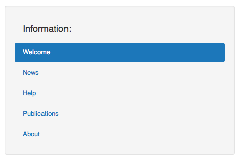
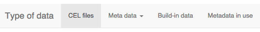
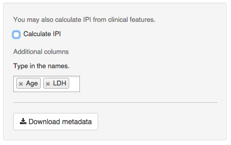
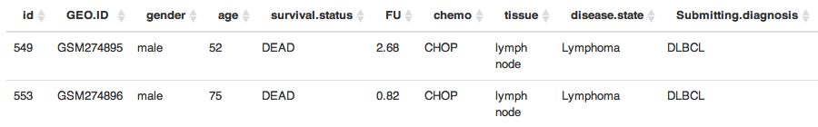
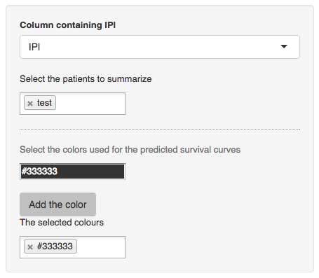

<!--
%\VignetteEngine{knitr::knitr}
%\VignetteIndexEntry{How to use hemaClass}
-->


# Introduction

The purpose of this guide is to help you use the hemaClass.org web application or the underlying **hemaClass** package for R. The guide is divided into two parts. The first part focuses on the hemaClass.org website while the second part concerns the hemaClass package. The accompanying article to **hemaClass** can be found [here.](https://github.com/oncoclass/hemaClass-paper)

The **hemaClass** package/website provides easy and fast access to various gene expression profile (GEP) based classifications of diffuse large B-cell lymphoma (DLBCL). The classification schemes are currently available only for GEPs using the Affymetrix GeneChip Human Genome U133 Plus 2.0 Array.
The classification schemes available are:
<!-- &#40; is needed to avoid rendering (C) as copyright symbol and (R) as registered trademark symbol. &#40 is a left parenthesis: ( -->

* Cell of origin classifiers:
    * B-cell associated signature (BAGS).
    * Activated B-cell like or Germinal Center like (ABC/GBC) classification and the BAGS extended version hereof.
* Resistance Gene Signature (REGS) classifiers:
    * Rituximab &#40;R)
    * Cyclophosphamide &#40;C)  
    * Doxorubicin (H)
    * Vincristine (O)
    * Melphalan (M)

In addition we also provide a resistance classifier for Dexamethasone (P). However, this classifier is still considered experimental and is not yet available through the website nor properly documented.


# Using hemaClass.org

The purpose of the **hemaClass** web application is to provide an online and user-friendly interface to the various developed DLBCL classification schemes available in the **hemaClass** package.

To use the website, either go to http://hemaclass.org or start a local instance off by running the following in R:
```{r, runHemaClass, eval = FALSE}
library("hemaClass")
runHemaClass()
```
This assumes that **hemaClass** is correctly installed. Instructions on installing **hemaClass** can be found below.
The local version is a good alternative which speeds up the process as CEL-files are not uploaded to the server.


## Overview of the website

Navigating the hemaClass website is primarily done using the tab panel on the top of the page.


Three options are available to you 
**Home**, 
**Load data**, and 
**Results**. 
Choosing **Home** simply takes you to the start page where access to various miscellaneous information is provided. The information is accessible through the navigation panel on the left.



As an example, if you want to have a look at all publications relevant to hemaClass go to **Home** and choose **Publications** in the information panel. In general, this box on the left side is context dependent providing additional settings or information. We now go into detail with **Load data** and **Results** in the following two sections.


## Load data

To use the classification schemes available on hemaClass.org, we first need to upload some data. To do this select **Load data** in the tab panel at the top of the page.

As you do this, the following second tab panel is made available.



hemaClass.org provides two quick-start approaches. In the tab **CEL files**, 4 test CEL-files can be downloaded and used for classification by following the steps of this manual. From the tab **Build-in data**, the build-in data of the website can be loaded and used for classification.


### CEL files

In case you want to classify your own data choose **CEL files** in the tab panel. Your CEL-files are uploaded by using the panel on the left hand side by pressing **Choose Files**.


**Note**: An issue with the shiny plugin we use for uploading files only allows one-by-one upload of files in some browsers, including Internet Explorer 9 and older.

After having uploaded the samples to be classified, they need to be normalized. hemaClass provides different methods for normalization of your samples and you have to choose which method you want to use.


There are two types of methods available: one-by-one normalization and cohort normalization. With one-by-one normalization you are able to normalize a single sample according to some chosen reference. Cohort based normalization requires a cohort of samples and normalization is done according to all samples. The one-by-one normalization methods available are:

* Use build-in reference: This method normalizes your samples according to a build-in reference dataset. There is currently 6 build-in reference datasets available.

* Build a new reference: This method requires you to collect CEL-files for uploading. Note, the performance of this normalization method has only been documented for references consisting of 30 CEL-files. When your samples are uploaded, the reference is build by pressing **Build the reference**.

* Upload a reference: This method requires you to normalize your reference CEL-files locally and then upload the final reference to the server. The uploaded reference has to be of the file type `.rds`.

Finally, to perform cohort based normalization, choose:

* Cohort based RMA: With this approach, RMA normalization of the uploaded CEL-files are conducted without using a reference. This method requires a large collection of samples in order to obtain accurate performance.

When you have chosen a normalization method follow the on-screen instructions to normalize your samples. The normalized and scaled expression levels will appear on the page when the preprocessing is terminated.


### Metadata

In **Metadata** you can provide metadata for your dataset by either entering it manually or uploading a file with metadata.
Currently **hemaClass** supports the following file-types for uploading metadata: `.txt`, `.rds`, `.RData`, and `.xls`.
If the metadata is typed in manually, the generated metadata sheet can be downloaded as a `.xls` file for later use.



If all nessesary metadata are uploaded or manually filled in, hemaclass.org is also able to calculate the corresponding IPI score of the patients.


### Build-in data

If you want to use the build-in data provided by us to test the system go to **Build-in-data**. We provide two datasets which you can choose from in the panel on the left hand side of the page.


The two build-in datasets LLMPP CHOP and LLMPP R-CHOP consists of 181 and 233 samples respectively. LLMPP CHOP contains gene expression data from patients treated with CHOP while LLMPP R-CHOP contains gene expression data from patients treated with R-CHOP. Metadata is available for both datasets.


### Metadata in use

The tab **Metadata in use** serves as a viewer of the uploaded or manullay entered metadata.




## Getting the results

To see the results of the classification go to the **Results** tab. In the tab **Estimated probabilities**, the results of the classifications are shown while in the **Patient summaries** tab conclusional journals and predicted survival curves are available .


### Estimated probabilities
In the **Estimated probabilities** the results of the classifications are shown. In the panel on the left hand side, the classification of interest is selected. 


On the right hand side of the screen the results of the chosen classifications are shown. You can also download the results as a `.txt` file by pressing the **Download classification results** button in the panel on the left.


In the results table the probabilities of the chosen classifications and the actual result of the classification are shown. When a classification scheme is chosen in the panel on the left an additional slider is added to the panel on the left. You can use the slider to vary the threshold for the classification.


### Patient summaries
In the **Patient summaries** a short summary of the data and the classification is generated. This includes survival curves, IPI scores and the BAGS classification results. In the panel on the left side of the page you can choose which patients you want summaries of. You also have to specify in which column of the metadata the IPI scores are placed. The page allows you to seperate patients by choosing specific colors for the predicted survival curves. This is done using the build-in color picker.




# Using the hemaClass R-package

One purpose of the **hemaClass** R-package is to make the functionality of hemaClass.org available programmatically. The **hemaClass** package also allows the user to run a local version of the hemaClass website as mentioned above.

## Installing the package

To install the latest version of **hemaClass** directly from [GitHub](https://github.com/oncoclass/hemaClass), run in R:

```{r, install, eval=FALSE}
# Install necessary packages
# First from bioconductor
source("http://bioconductor.org/biocLite.R")
biocLite(c("affy", "affyio", "preprocessCore"))

# Then from CRAN
install.packages(c("shiny", "matrixStats", "Rcpp", "RcppArmadillo",
                   "RcppEigen", "testthat", "WriteXLS"))

# From GitHub
install.packages("devtools")
devtools::install_github("AnalytixWare/ShinySky")

# Finally the package is installed.
devtools::install_github("oncoclass/hemaClass", dependencies = TRUE,
                         build_vignettes = TRUE)
```

Be sure that you have the [package development prerequisites](http://www.rstudio.com/ide/docs/packages/prerequisites) if you wish to install the package from the source. **hemaClass** is still under development and may change from time to time. Check `news(package = "hemaClass")` for all relevant news.


## Classifications with the hemaClass package

Here we provide a short example of a script using the functions implemented in **hemaClass**. First, we need to load the package and read in the CEL-files. The four test CEL-files provided in **hemaClass** are loaded.
```{r, load_and_list_cel_files, message=FALSE}
library("hemaClass")  # Load package (startup messages are not shown here)

# List and read your CEL files
#path <- "path/to/celfiles"
path <- system.file("extdata/celfiles", package = "hemaClass")
cel.files <- list.files(path, pattern = "\\.cel", 
                        ignore.case = TRUE, full.names = TRUE)
batch <- readCelfiles(filenames = cel.files) 
```
The data is now stored in the `batch` object. In order to use your own CEL-files, follow the comment in the above code and rewrite `path` as the folder containing your CEL-files. This creates a `character` vector of all CEL-files in the directory `path/to/celfiles`.

Next, we proceed to the RMA pre-processing. To do this, we read one of the predefined references, do the RMA pre-processing using the reference, and then extract the relevant data:
```{r, preprocessing}
# Pre-processing the .CEL files
ref <- readLLMPPCHOPreference()  # Use LLMPPCHOP as reference
data <- rmaReference(batch, reference = ref)
data.sc <- data$exprs.sc
```
If you want to use cohort based normalization you can instead use the function `rmaPreprocessing` which is also supplied in the package.

We carry on and conduct the actual classification. Here we consider BAGS classification and print the results:
```{r, classification}
bags.results <- BAGS(data.sc)  # BAGS Classification
print(bags.results)
``` 
To perform one of the other classifications use the functions `REGS` or `ABCGCB` instead of `BAGS`. The `ABCGCB` function performs the ABC/GCB cell of origin classification. For more information on how to use the drug resistance classifiers, run `?REGS`.

The above script uses the build-in one-by-one normalization with the build-in LLMPPCHOP dataset as reference. If you want to use a different build-in reference change the reference dataset by writing one of the following instead of `readLLMPPCHOPreference`.
```{r, alternative_references, eval=FALSE}
ref <- readCHEPRETROreference()
ref <- readIDRCreference()
ref <- readLLMPPRCHOPreference()
ref <- readMDFCIreference()
ref <- readUAMSreference()
```


# Questions

If you encounter any issues or bugs using either the hemaClass website or the **hemaClass** R-package, or if you have suggestions for improvements please do not hesitate to report it to us at [GitHub](https://github.com/oncoclass/hemaClass/issues). You are also very welcome to send us questions or comments via [e-mail](mailto:martin.boegsted@rn.dk).

***

**Disclaimer:** The package and website is intended for experimental use only. We stress that we disclaim against responsibility for the effects of the classifications. For instance we neither accept liability for the classifications performed, nor for the consequences of any actions taken on the basis of the information provided.
