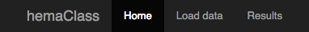

<!--
%\VignetteEngine{knitr::knitr}
%\VignetteIndexEntry{How to use hemaClass}
-->


# Introduction

The purpose of this guide is to help you use the hemaClass.org web application or the underlying the **hemaClass** package for R. The guide is divided into two parts. The first part focuses on the hemaClass.org website, and the second part is about the hemaClass package. The accompanying article to **hemaClass** can be found [here.](https://github.com/oncoclass/hemaClass-paper)

The **hemaClass** package/website provides easy and fast access to various gene expression profile (GEP) based classifications of diffuse large B-cell lymphoma (DLBCL). The classification schemes are currently available only for GEPs using the Affymetrix GeneChip Human Genome U133 Plus 2.0 Array.
The classification schemes available are:
<!-- &#40 is needed to avoid rendering (C) as copyright symbol and (R) as registered trademark symbol. &#40 is a left parenthesis: ( -->
* Cell of origin classifiers:
    * B-cell associated signature (BAGS).
    * Activated B-cell like or Germinal Center like (ABC/GBC) classification and the BAGS extended version hereof.
* Resistance Gene Signature (REGS) classifiers:
    * Cyclophosphamide &#40;C)  
    * Doxorubicin (H)
    * Vincristine (O)
    * Rituximab &#40;R)
    * Melphalan (M)

In addition we also provide a resistance classifier for Dexamethasone (P). However, this classifier is still considered experimental and is not yet available through the website nor properly documented.


# Using hemaClass.org

The purpose of the **hemaClass** web application is to provide an online and user-friendly interface to the various developed DLBCL classification schemes available in the **hemaClass** package.

To use the website, either go to http://hemaclass.org or start a local instance of by running the following in R:
```{r, runHemaClass, eval = FALSE}
library("hemaClass")
runHemaClass()
```
This assumes that **hemaClass** is correctly installed. Instructions on installing **hemaClass** can be found below.
Primarily, the local version can use to avoid uploading many large files.


## Overview of the website

Navigating the hemaClass website is primarily done using the tab panel on the top of the page.



Three options are available to you 
**Home**, 
**Load data** and 
**Results**. 
Choosing **Home** simply takes you to the start page where access to various miscellaneous information is provided. The information is accessible through the navigation panel on the left.


As an example, if you want to have a look at all publications relevant to hemaClass go to **Home** and choose **Publications** in the information panel. In general, this box on the left side is context dependent providing additional settings or information. We now go into detail with **Load data** and **Results** in the following two sections.


## Load data

To use the classification schemes available on hemaClass.org, we first need to upload some data. To do this select **Load data** in the tab panel at the top of the page.

As you do this, the following second tab panel is made available.


To use your own data, then the by default selected **CEL files** is of interest. However, if you want to get started quickly, use the test data provided by choosing **Build-in data**.


### CEL files

In case you want to classify your own data choose **CEL files** in the tab panel. Here you have the possibility of uploading your data using the panel on the left hand side box by pressing **Choose Files**.


**Note**: An issue with the shiny plugin we use for uploading files makes it impossible to upload more than one file in some browsers, including Internet Explorer 9 and older.

After you have uploaded the samples you want to classify, they need to be normalized. hemaClass provides different methods for normalization of your samples, and you have to choose which method you want to use.


There is two types of methods available, one-by-one normalization and cohort normalization. With one-by-one normalization you can normalize a single sample according to some chosen reference. With cohort based normalization you need a cohort of samples, and normalization is done according to the samples. The one-by-one normalization methods available are:

* Use build in reference: This method normalizes your samples according to a build in reference dataset. There is currently 6 build in reference datasets available.

* Build a reference: With this method you build a reference of .CEL files that you upload. Be aware that the performance for this method of normalization has only been documented for references consisting of 30 .CEL files.  When the samples you want to use as a reference has been uploaded press **Build the reference**.

* Upload a reference: With this method you normalize your samples to a reference that you upload. The reference that you upload has to be of the file type `.rds`.

Finally to do cohort based normalization choose:

* Cohort based RMA: The final method is Cohort based normalization, where all the samples you provide are used for normalization. This method is best for when you have a large collection of samples.

Choose the normalization method which is most suitable for the samples you have and that you want to classify. When you have chosen a normalization method follow the onscreen instructions to normalize your samples.

When you have finished the preprocessing of your samples you will be able to see the data on the page.


### Metadata

In **Metadata** you can provide metadata for your dataset by either entering the metadata manually or uploading a file with metadata.
Currently **hemaClass** supports the following file-types for uploading metadata: `.txt`, `.rds`, `.RData`, and `.xls`.
If you type in the metadata manually you are also able to download it afterwards as `.xls` file for later use.


Using the metadata you are able to calculate the IPI score of the patient.


### Build-in data

If you want to use the build-in data provided by us to test the system go to **Build-in-data**. We have provided two datasets which you can choose from in the panel on the left hand side of the page.


The two build-in datasets LLMPP CHOP and LLMPP R-CHOP consists of 181 and 233 samples respectively. LLMPP CHOP provides gene expression data from patients treated with CHOP, and LLMPP R-CHOP provides gene expression data from patients treated with R-CHOP. Metadata is available for both datasets.


### Metadata in use

In the final tab of the **Load data** page you are able to see the metadata that is either available or that you have provided.


## Getting the results

To see the results of the classification go to the **Results** tab on the main tab panel. The results are first available when you have correctly uploaded and preprocessed data, or if you have chosen the build-in data. In the **Estimated probabilities** tab you can see the results of the classifications, and in the **Patient summaries** tab plots of survival curves and IPI scores are available.


### Estimated probabilities
In the **Estimated probabilities** you can see the results of the classification of your data. In the panel on the left hand side of the page you can choose which classification results you want to display.


On the right hand side of the screen the results of the chosen classifications are shown. You can also download the results as a `.txt` file by pressing the **Download classification results** button in the panel on the left.


In the results table the probabilities of the chosen classifications and the actual result of the classification are shown. When a type of classification is chosen in the panel on the left, an additional slider is added to the panel on the left. You can use the slider to vary the cut-points for the classification.


### Patient summaries
In the **Patient summaries** we have made a short summary of the data and the classification. This includes survival curves, IPI scores and the BAGS classification results. In the panel on the left side of the page you can choose which patients you want summaries of. You also have to specify in which column the metadata the IPI scores are placed. For the survival curves you can choose which colors you prefer for the plot. This is done using the build in color picker.


# Using the hemaClass R-package

One purpose of the **hemaClass** R-package is to make the functionality of the hemaClass website available programmatically. The **hemaClass** package also provides the opportunity to run a local version of the hemaClass website as explained above.

## Installing the package

To install the latest version of **hemaClass** directly from [GitHub](https://github.com/oncoclass/hemaClass), in R run:

```{r, install, eval=FALSE}
# Install necessary packages
# First from bioconductor
source("http://bioconductor.org/biocLite.R")
biocLite(c("affy", "affyio", "preprocessCore"))

# Then from CRAN
install.packages(c("shiny", "matrixStats", "Rcpp", "RcppArmadillo",
                   "RcppEigen", "testthat", "WriteXLS"))

# From GitHub
install.packages("devtools")
devtools::install_github("AnalytixWare/ShinySky")

# Finally the package is installed.
devtools::install_github("oncoclass/hemaClass", dependencies = TRUE,
                         build_vignettes = TRUE)
```

**hemaClass** is still under development and may change from time to time. Be sure that you have the [package development prerequisites](http://www.rstudio.com/ide/docs/packages/prerequisites) if you wish to install the package from the source.
Check `news(package = "hemaClass")` for all relevant news.


## Classifications with the hemaClass package

Here we provide a short example of a script using the functions implemented in **hemaClass**. First, we need to load the package and read in the `.CEL` files. Four `.CEL` files is provided with **hemaClass** for testing which we load 
```{r, load_and_list_cel_files, message=FALSE}
library("hemaClass")  # Load package (startup messages are not shown here)

# List and read your CEL files
cel.files <- list.files(system.file("extdata/celfiles", package = "hemaClass"), 
                        full.names = TRUE)
batch <- readCelfiles(filenames = cel.files) 
```
The data is now stored in the `batch` object.

To use your own `.CEL` files, swap the second line of the code above with something like the following after substituting the correct path to your celfiles:
```{r, list_cel_files}
cel.files <- list.files(path = "path/to/celfiles", pattern = "\\.cel",
                        ignore.case = TRUE, full.names = TRUE)
```
This creates a `character` vector of all `.CEL` files in the directory `path/to/celfiles`.

Next, we proceed with the RMA pre-processing. To do this, we read one of the predefined references, do the RMA pre-processing using the reference, and then extracting the relevant data:
```{r, preprocessing}
# Pre-processing the .CEL files
ref <- readLLMPPCHOPreference()  # Use LLMPPCHOP as reference
data <- rmaReference(batch, reference = ref)
data.sc <- data$exprs.sc
```
If you want to use cohort based normalization you can instead use the function `rmaPreprocessing`, which is also supplied in the package.

We carry on and do the actual classification. Here we do the BAGS classification and print the results:
```{r, classification}
bags.results <- BAGS(data.sc)  # BAGS Classification
print(bags.results)
``` 
To do a different classification than BAGS, use the functions `REGS` or `ABCGCB` instead of `BAGS`.
The `ABCGCB` function performs the ABC/GCB cell of origin classification.
For more information on how to use the drug resistance classifiers, run `?REGS`.

The script uses the build-in one-by-one normalization with the build-in LLMPPCHOP dataset as reference. If you want to use a different build-in reference swap out the reference line with one of the following:
```{r, alternative_references, eval=FALSE}
ref <- readCHEPRETROreference()
ref <- readIDRCreference()
ref <- readLLMPPRCHOPreference()
ref <- readMDFCIreference()
ref <- readUAMSreference()
```


# Questions

If you encounter any issues or bugs using either the hemaClass website or the **hemaClass** R-package, or if you have suggestions for improvements please do not hesitate to report it to us at [GitHub](https://github.com/oncoclass/hemaClass/issues). You are also very welcome to send us questions or comments via [e-mail](mailto:martin.boegsted@rn.dk).

***

**Disclaimer:** The package and website is intended for experimental use only. We stress that we disclaim against responsibility for the effects of the classifications.  For instance we neither accept liability for the classifications performed, nor for the consequences of any actions taken on the basis of the information provided.
