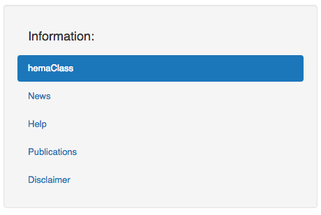
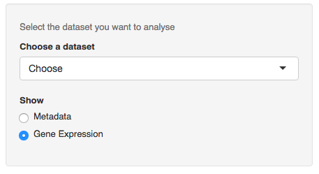

<!--
%\VignetteEngine{knitr::knitr}
%\VignetteIndexEntry{How to use hemaClass}
-->

```{r, echo = FALSE, message = FALSE}
knitr::opts_chunk$set(
  comment = "#>",
  error = FALSE,
  tidy = FALSE
)
```

# Introduction

The purpose of this guide is to help you use the hemaClass webpage and the hemaClass R-package. The guide is divided into two parts. The first part focuses on the hemaClass.org webpage, and the second part is about the hemaClass package.

We want to stress that we disclaim against responsibility for the effects of the classifications. For instance we neither accept liability for the classifications performed, nor for the consequences of any actions taken on the basis of the information provided.

hemaClass provides access to GEP based classification schemes of diffuse large B-cell lymphoma (DLBCL). The classification schemes are currently available for gene expressions profiled by the Affymetrix GeneChip Human Genome U133 Plus 2.0 Array.

The classification schemes available are:

* Cell of origin classifiers:
    * B-cell associated signature (BAGS)
    * Activated B-cell like or Germinal Center (ABC/GBC)
* Resistance Gene Signatures (REGS):
    * Cyclophosphamide &#40;C)
    * Doxorubicin (H)
	* Vincristine (O)

In addition we also provide REGS for Rituximab &#40;R), Dexamethasone (P) and Melphalan (M). But the predictions of these schemes have not been properly documented yet, and we take no responsibility for the predictions.

<br> <br>
# Using hemaClass.org

The purpose of the webpage [hemaClass.org](http://www.hemaclass.org) is to provide online and userfriendly access to the DLBCL classification schemes we have developed.

## Navigating the page

Navigation on the hemaClass webpage is done using the tab panel on the top of the page.


Three options are available to you `Home`, `Load data` and `Results`. Choosing `Home` simply takes you to the start page, where there is access to some miscellaneous information. The information is accessible through the navigation panel on the left.



As an example, if you want to have a look at the publications regarding hemaClass go to `Home` and choose `Publications` in the information panel. We will go into more detail with the options `Load data` and `Results` in the following two sections.


## Loading data

To use the classifcation schemes available on hemaClass.org, we need to load some data. To do this select `Load data` in the tab panel on the top of the page.

As you do this, the following second tab panel is made available.


To use your own data choose `CEL files`, or if you want to use the test data provided by us choose `Build-in data`.

### CEL files

In case you want to classify your own data choose `CEL files` in the tab panel. Here you have the possibility of uploading your data using the panel on the left hand side of the page.


**Note**: An issue with the shiny plugin we use for uploading files makes it impossible to upload more than one file on some older browsers, including Internet Explorer 9 and older.

After you have uploaded the samples you want to classify they need to be normalized. hemaClass provides different methods for normalization of your samples, and you have to choose which method you want to use.


The methods for normalization is:

* Use build in reference: This method normalizes your samples according to a build in reference dataset. There is currently 6 build in reference datasets available.

* Build a reference: With this method you build a reference of .CEL files that you upload. Be aware that the performance for this method of normalization has only been documented for references consisting of 30 .CEL files.  When the samples you want to use as a reference has been uploaded press `Build the reference`.

* Upload a reference: With this method you normalize your samples to a reference that you upload. The reference that you upload has to be of the filetype .rds.

* Cohort based RMA: The final method is Cohort based normalization, where all the samples you provide are used for normalization. This method is best for when you have a large collection of samples.

Choose the normalization method which is most suitable for the samples you have and that you want to classify. When you have choosen a normalization method follow the onscreen instructions to normalize your samples.

When you have finished the preprocessing of your samples you will be able to see the data on the page.


### Metadata

In `Metadata` you can provide metadata for your dataset by either entering the metadata manually or uploading a file with metadata.

Currently hemaClass supports the following filetypes for uploading metadata: .txt, .rds, .RData and .xls.

If you type in the metadata manually you are also able to download it afterwards as .xls file.


Using the metadata you are able to calculate the IPI score of the patient.

### Build-in data

If you want to use the build-in data provided by us to test the system go to `Build-in-data`. We have provided two datasets which you can choose from in the panel on the left hand side of the page.



The two datasets provided by us consists of... . Also, metadata is available for both datasets.


### Metadata in use

In the final tab of the `Load data` page you are able to see the metadata that is either available or that you have provided.


## Getting the results

To see the results of the classification of the data you have choosen go to the `Results` tab on the main tab panel. In the `Estimated probabilities` tab you can see the results of the classifications, and in the `Patient summaries` tab plots of survival curves and IPI scores are available.


### Estimated probabilities
In the `Estimated probabilities` you can see the results of the classification of your data. In the panel on the left hand side of the page you can choose which classification results you want to display.


On the right hand side of the screen the results of the chosen classifications are shown. You can also download the results as a .txt file by pressing the `Download classification results` button in the panel on the left.


In the results table the probabilities of the chosen classifications are shown, and the actual result of the classification. When a type of classification is chosen in the panel on the left, an additional slider is added to the panel on the left. You can use the slider to vary the cutpoints for the classification.


### Patient summaries
In the `Patient summaries` we have made a short summary of the patients available. This includes survival curves, IPI scores and the BAGS classification results. In the panel on the left side of the page you can choose which patients you want summaries of. You also have to specify in which column the metadata the IPI scores are placed. For the survival curves you can choose which colors you prefer for the plot. This is done using the build in color picker.


<br> <br>
# Using the hemaClass R-package

The purpose of the hemaClass R-package is to make our classification schemes and the source code available to anyone interested. With the hemaClass R-package you can also run a local version of the hemaClass webpage.

## Installing the package

To install the latest version of `hemaClass` directly from [GitHub](https://github.com/oncoclass/hemaClass), in R run:

```R
# Install necessary packages
# First from bioconductor
source("http://bioconductor.org/biocLite.R")
biocLite(c("affy", "affyio", "preprocessCore"))

# Then from CRAN
install.packages(c("shiny", "matrixStats", "Rcpp", "RcppArmadillo",
                   "RcppEigen", "testthat", "WriteXLS"))

# From GitHub
install.packages("devtools")
devtools::install_github("AnalytixWare/ShinySky")

# Finally the package is installed.
devtools::install_github("oncoclass/hemaClass", dependencies = TRUE)
```

`hemaClass` is still under development and should be considered unstable. Be sure that you have the [package development prerequisites](http://www.rstudio.com/ide/docs/packages/prerequisites) if you wish to install the package from the source.

**Note:** The interface and function names may still see significant changes and modifications!

## Functions included in hemaClass

<br><br>
# Questions

If you encounter any issues or bugs using either the hemaClass webpage or the hemaClass R-package, or if you have suggestions for improvements please report it to us at [GitHub](https://github.com/oncoclass/hemaClass/issues). You are also welcome to send us questions or comments on [mail](mailto:martin.boegsted@rn.dk).
